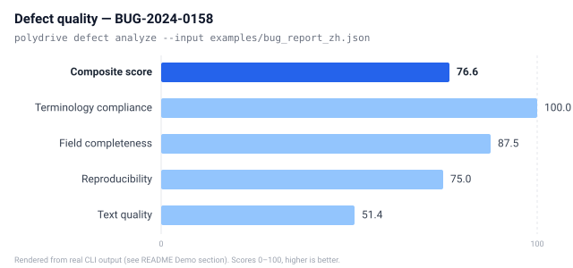

# PolyDrive

[](https://github.com/BUNSEI1212/polydrive/actions/workflows/test.yml)
[](LICENSE)
[](pyproject.toml)

**[English](README.md)** | [中文](README.zh-CN.md) | [日本語](README.ja.md)

> Language governance toolkit for multinational automotive testing teams.

PolyDrive makes language-related friction **visible, measurable, and actionable** in your testing workflow. It's a CLI-first toolkit for terminology consistency, defect quality, i18n guarding, translation orchestration, and compliance traceability.

## Why PolyDrive?

In multinational automotive testing, language isn't a "translation efficiency" problem — it's a **defect amplifier** that impacts:

- **Requirements traceability** when terms drift across languages
- **Defect reproduction rates** when descriptions lose meaning in translation
- **CI pipelines** when encoding issues cause ghost bugs
- **Compliance** when HMI text doesn't meet regional regulations

Existing tools solve parts of the problem, but few open-source tools connect terminology, defect quality, i18n checks, and traceability specifically for automotive testing workflows. PolyDrive fills this gap.

## Six Modules

| Module | CLI Command | Purpose |
|--------|-------------|---------|
| `glossary` | `polydrive glossary` | TBX/CSV terminology import, consistency checking, export |
| `i18n` | `polydrive i18n` | Encoding checks, hardcoded CJK detection, pseudo-localization, Qt validation |
| `defect` | `polydrive defect` | Defect report quality scoring, template validation, language detection |
| `mt` | `polydrive mt` | Multi-engine translation with glossary enforcement and caching |
| `trace` | `polydrive trace` | Gherkin multi-language sync, UNECE R121 compliance, ASPICE evidence |
| `metrics` | `polydrive metrics` | Quality metrics summary, Prometheus export, HTML reports |

Plus `polydrive serve` to start the REST API server.

## Quick Start

```bash
# Install from source
git clone https://github.com/BUNSEI1212/polydrive.git
cd polydrive
pip install -e .

# Check file encodings (detect non-UTF-8 and BOM issues)
polydrive i18n check-encoding examples/bad_encoding/ --require-utf8 --fail-on-bom

# Detect hardcoded CJK in C/C++ source
polydrive i18n detect-hardcoded examples/cpp_project/ --lang cpp

# Import a multilingual glossary
polydrive glossary import examples/automotive_terms.csv

# Generate pseudo-localized resources
polydrive i18n pseudo-localize examples/locales/en.json --mode expand+cjk

# Analyze a defect report
polydrive defect analyze --input examples/bug_report_zh.json

# Start REST API server
polydrive serve --port 8080
```

See [examples/README.md](examples/README.md) for detailed demo instructions.

## Demo

Every command below was run against the bundled `examples/` data. Output shown is
abridged for readability — run it yourself to see the full Rich-rendered tables.

**Encoding guard** — flag non-UTF-8 files and BOM markers before they break a
multilingual CI pipeline:

```
$ polydrive i18n check-encoding examples/bad_encoding/ --require-utf8 --fail-on-bom

                   Encoding Issues in examples/bad_encoding/
┌────────────────────┬──────┬──────────┬───────────┬──────────────────────┐
│ File               │ Line │ Type     │ Detected  │ Details              │
├────────────────────┼──────┼──────────┼───────────┼──────────────────────┤
│ gb2312_file.cpp    │    - │ non_utf8 │ gb18030   │ File is gb18030...   │
│ shift_jis_file.cpp │    - │ non_utf8 │ cp932     │ File is cp932...     │
│ utf8_with_bom.cpp  │    - │ has_bom  │ utf-8-sig │ File contains a BOM  │
└────────────────────┴──────┴──────────┴───────────┴──────────────────────┘
```

**Hardcoded-string detection** — find CJK literals embedded in C/C++ source that
should live in i18n resources:

```
$ polydrive i18n detect-hardcoded examples/cpp_project/ --lang cpp

                  Hardcoded Strings in examples/cpp_project/
┌────────────────────────┬──────┬─────┬──────────────────────────────┐
│ File                   │ Line │ Col │ Text                         │
├────────────────────────┼──────┼─────┼──────────────────────────────┤
│ dashboard.cpp          │    8 │   7 │ 制动液位过低，请及时补充     │
│ dashboard.cpp          │   10 │  30 │ 制动系统故障，请立即停车检查 │
│ instrument_cluster.cpp │    6 │   7 │ 点検時期が過ぎています       │
│ ...                    │      │     │ (9 hardcoded strings total)  │
└────────────────────────┴──────┴─────┴──────────────────────────────┘
```

**Defect-report quality** — score a cross-language bug report and surface what's
missing:

```
$ polydrive defect analyze --input examples/bug_report_zh.json

Defect report BUG-2024-0158  severity: info  composite score: 76.6
        Quality Breakdown
┌────────────────────────┬───────┐
│ Dimension              │ Score │
├────────────────────────┼───────┤
│ Field completeness     │  87.5 │
│ Text quality           │  51.4 │
│ Reproducibility        │  75.0 │
│ Terminology compliance │ 100.0 │
└────────────────────────┴───────┘
Detected language: no
⚠ Language mixing detected: 48% non-dominant script (dominant: cjk)
Missing fields: environment
Suggestions:
  • Add environment details (OS, version, platform, etc.)
  • Description is a single sentence — add more detail
```

**Pseudo-localization** — stress-test HMI layouts before real translation lands.
`"Engine Temperature"` → `"[Êñ夕ïñê 七ê山巳ê尺ä七û尺ê -------]"` (expand+cjk mode),
written to `examples/locales/en.pseudo.json`.

## Screenshots

A visual of `polydrive defect analyze` scoring the bundled Chinese/German
defect report (`examples/bug_report_zh.json`) — every value below comes from a
real run, not a mock:



The full Rich-rendered tables for every command are in the [Demo](#demo)
section above. To capture your own animated demo as a GIF:

```bash
# Record a terminal session, then render to GIF (requires asciinema + agg)
asciinema rec demo.cast --command "polydrive defect analyze --input examples/bug_report_zh.json"
agg demo.cast demo.gif
```

## More Commands

```bash
# Terminology consistency check (requires TBX format)
polydrive glossary check terms.tbx --lang-pair en:zh

# Translate with glossary enforcement
polydrive mt translate --text "Bremsfehler erkannt" --from de --to en --glossary terms.tbx

# Validate Qt translations
polydrive i18n validate-qt translations/app_zh_CN.ts

# Check Gherkin feature sync across languages
polydrive trace sync-gherkin --base en --compare zh,de --features tests/

# Check UNECE R121 HMI compliance
polydrive trace unece-check --manifest hmi_manifest.json

# Collect ASPICE language evidence
polydrive trace aspice-evidence --project .

# View quality metrics
polydrive metrics summary --input metrics.json
```

## Architecture

```
┌──────────────────────────────────────────────────────────────┐
│                      PolyDrive Platform                        │
├──────────┬──────────┬──────────┬───────────┬─────────────────┤
│ glossary │ defect   │ i18n     │ mt        │ trace / metrics │
│ 术语引擎  │ 质检器    │ 国际化守卫 │ 翻译编排   │ 追溯 / 度量     │
├──────────┴──────────┴──────────┴───────────┴─────────────────┤
│            core (terminology / encoding / models)               │
├──────────────────────────────────────────────────────────────┤
│   CLI (Typer)   │   API (FastAPI)   │   Plugins              │
└──────────────────────────────────────────────────────────────┘
```

## Standards Support

- **TBX (ISO 30042)** — Terminology exchange
- **TMX** — Translation memory exchange
- **BCP 47** — Language tag identification
- **Automotive SPICE 4.0** — Process compliance evidence (SWE.1–SWE.6, MAN.6)
- **UNECE R121** — HMI tell-tale and indicator requirements
- **Gherkin** — Multi-language BDD scenario management (70+ languages)

## CI Integration

PolyDrive ships a reusable GitHub Action to run its i18n checks as a PR gate:

```yaml
- uses: BUNSEI1212/polydrive/.github/actions/i18n-check@v0.1.0
  with:
    path: src
    # install-command defaults to `pip install polydrive`;
    # for a source checkout use e.g. `pip install -e .`
```

It runs `check-encoding` (with `--require-utf8 --fail-on-bom`) and, when C/C++
sources are present, `detect-hardcoded`. Both exit non-zero on findings, so a
single check can block a merge. This repository dogfoods the action in
`.github/workflows/i18n-guard.yml`.

## Impact & Roadmap

### Who feels the pain

PolyDrive targets the friction that multinational automotive **testing teams**
hit daily — not translation teams in isolation:

- **Distributed test cells** (DE/CN/JP/US) file defects in their native language;
  the receiving team must reproduce a bug whose description has drifted in
  translation. PolyDrive's `defect` module scores reproducibility and flags
  language mixing so gaps are visible before triage.
- **HMI homologation** must meet regional tell-tale/indicator rules. `trace`
  checks UNECE R121 compliance and collects ASPICE language evidence in one
  pass instead of a manual audit spreadsheet.
- **CI pipelines** break silently when a Shift-JIS or GB2312 source file lands in
  a UTF-8 toolchain. `i18n check-encoding` turns that into a fast, loud failure.
- **Terminology drift** across requirements → tests → defects erodes
  traceability. `glossary` keeps one canonical term set across languages.

PolyDrive is intentionally narrow and open: it connects terminology, defect
quality, i18n guarding, and traceability in one CLI that fits a CI step — a gap
most existing tools leave to spreadsheets and bespoke scripts.

### Roadmap

PolyDrive is young (0.x). Planned directions, tracked as GitHub issues when
picked up:

- **More standards**: ISO 26262 safety terminology, ISO/SAE 21434 cybersecurity
  terms, AUTOSAR ARXML extraction, ISO 9241 HMI ergonomics checks.
- **Translation quality**: MQM/DAQP error typology scoring on the `mt` gateway,
  not just pass-through translation.
- **Automation**: terminology extraction from existing defect/test corpora to
  bootstrap a glossary, and a first-class GitHub Action so every check runs on PRs.
- **Ecosystem**: language-server / IDE integrations so terminology and
  hardcoded-string warnings surface while writing, not after commit.
- **Reach**: more BCP 47 locales and a web UI on top of the existing REST API.

The BSL → Apache 2.0 conversion (36 months per release) keeps the long tail
fully open while early commercial use funds maintenance.

## Development

```bash
git clone https://github.com/BUNSEI1212/polydrive.git
cd polydrive

# Install with dev dependencies
pip install -e ".[dev]"

# Run tests
python -m pytest -v

# Lint
ruff check .
ruff format --check .
```

## Maintenance & Governance

PolyDrive is currently maintained by a **solo maintainer**. To stay sustainable
at that scale, the workflow is deliberately tool-assisted and process-light:

- **Issue triage** — bugs and feature requests land in
  [GitHub Issues](https://github.com/BUNSEI1212/polydrive/issues) and are
  labelled by module (`glossary`, `i18n`, `defect`, …) and kind
  (`bug`, `enhancement`, `standard`). A clear reproduction (input file +
  command + expected vs. actual) moves an issue to the front of the queue.
- **Feature planning** — larger work is scoped against the
  [Roadmap](#impact--roadmap) and tracked in milestones before code lands, so
  scope stays bounded. Propose ideas via an issue tagged `discussion` first.
- **Tooling leverage** — the maintainer leans on automation to multiply
  effort: a CI matrix catches platform regressions, `ruff` + `pytest` guard
  style and behavior on every change, and PolyDrive itself is
  [dogfooded](https://en.wikipedia.org/wiki/Eating_your_own_dog_food) — its
  own CLI checks run against bundled examples as integration tests
  (`tests/test_examples.py`) and as a reusable GitHub Action gated on every
  PR (`.github/workflows/i18n-guard.yml`). AI-assisted development handles
  routine refactors and test scaffolding so review stays focused on design.
- **Releases** — versioned per semver; the BSL change-date mechanism converts
  each release to Apache 2.0 after 36 months, keeping old versions usable
  even as the project evolves.

Contributions are welcome — see [CONTRIBUTING.md](CONTRIBUTING.md). For
commercial use or a custom change-date, open an issue to discuss licensing.

## My Role as Maintainer

I'm the solo maintainer of PolyDrive and own the full lifecycle — architecture,
implementation, review, and release — with a workflow tuned for one person:

- **Solo development** — I design and implement across all six modules myself,
  keeping the surface small and consistent so a single person can hold the whole
  system in mind. Every change ships through a branch + pull request, even when
  I'm the only reviewer, so the history stays auditable.
- **Bug fixing, evidence-first** — when something breaks I reproduce it, find
  the root cause before touching code, and add a regression test. Recent
  examples: `defect analyze` silently printed nothing in text mode (#6), and
  `detect-hardcoded` exited 0 on findings — which would have neutered the CI
  gate (#7). Both fixed test-first (RED → GREEN).
- **Feature planning** — the [Roadmap](#impact--roadmap) drives priorities;
  larger work becomes a tracked GitHub issue with context, open questions, and
  acceptance criteria *before* any code is written (e.g. #3, #5), and a triage
  comment sets priority and a target milestone.
- **Automation as leverage** — a solo maintainer can't review by hand, so I let
  tools do it: `ruff` + `pytest` on every change, a CI matrix for platform
  coverage, and a reusable GitHub Action that dogfoods PolyDrive's own checks on
  every PR. PolyDrive checks its own examples.
- **AI-assisted development** — I use AI (Claude Code) to accelerate routine
  work: drafting tests, refactors, exploring the codebase, and producing docs.
  I stay the reviewer: I verify every change against real command output and
  tests before merging, and I disclose AI co-authorship in commit messages. AI
  extends my reach; it doesn't replace my judgment.
- **Releases** — semver tags with a BSL → Apache 2.0 change-date, so old
  versions stay usable. `v0.1.0` is out.

I maintain this because the gap — connecting terminology, defect quality, i18n,
and traceability for multinational automotive testing — isn't well served by
existing open source.

## License

PolyDrive is available under the **Business Source License 1.1**.

- **Non-commercial use**: Free (academic, personal, open source projects)
- **Commercial use**: Requires a commercial license
- **Change Date**: Each version converts to **Apache License 2.0** 36 months after release

See [LICENSE](LICENSE) for details.
